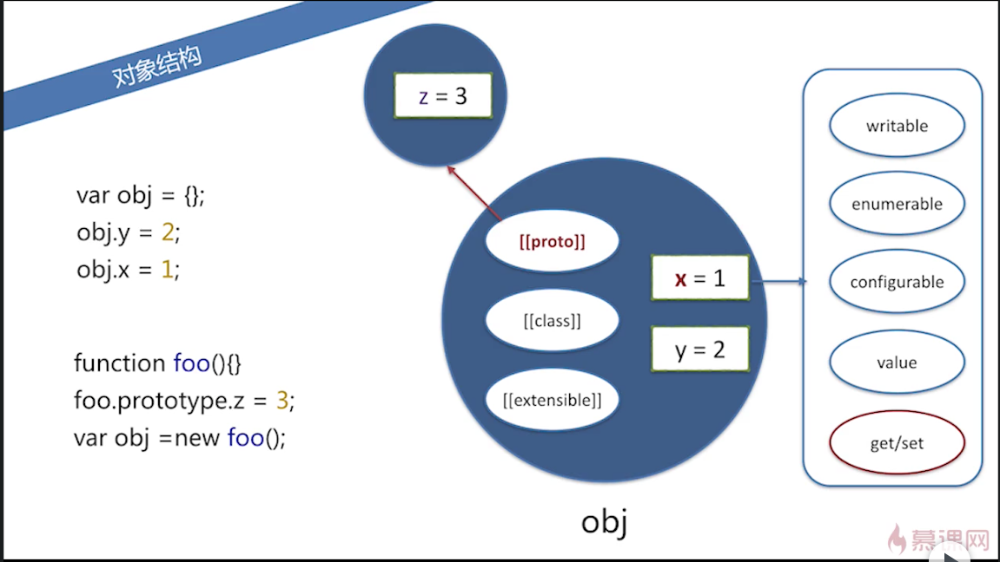

# 第 4 章 对象概述

## 4 - 1 对象概述

### 概述

对象中包含一系列属性，这些属性是**无序**的。
每个属性都有一个**字符串 key**和对应的 value。

```js
var obj = {};
obj[1] = 1;
obj['1'] = 2;
obj; // Object {1: 2}
// 上面可以看错，不管是数字型的1作为属性，还是字符串型的'1'作为属性，他们指向同一个属性。

obj[{}] = false;
obj[{ x: 1 }] = true;
obj; // Object {1:2, [object Object]: true}
// 同样，这里不管是空对象，还是属性x为1的对象作为key，都是把它们toString()之后作为key，他们最终指向同一个属性。
```

### 对象结构

对象的每个属性都有一些便签，比如：

- writable
- enumerable
- configurable
- value
- get/set
- `__proto__`
- 等等

图示：



## 4 - 2 创建对象、原型链

### 对象创建-字面量

`var obj1 = {x: 1, y: 2};`

### 对象创建-new/原型链

使用 new 构造对象的好处，对象的原型会指向构造器的 prototype 属性。

当访问一个对象的属性时，先看该对象有没有这个属性，如果有就使用该对象的该属性值，如果没有，则向上查找该对象的原型链上有没有这个属性。
当查找到最后的 prototype 为 null 时还没有查找到，就返回 undefined.

注意`in`和`hasOwnProperty`的区别。

原型链示意图：


但是，当给对象的属性赋值的时候，不会通过原型链向上查找。
也就是说，当给对象的属性赋值时，会看这个对象上有没有这个属性，如果有，直接修改属性的值；
如果没有，直接在这个对象上新加这个属性，而不会修改对象原型链上的值。

示意图：


如果给一个对象的属性赋值为 undefined 的话，这个属性还是存在的，只不过值为 undefined。
所以，如果访问一个对象的属性时返回 undefined，不一定是对象没有这个属性，可能是有这个属性，只不过值为 undefined。
此时，可以通过`hasOwnProperty`和`in`来区分。

如果所示：


那么，如果要删掉对象的属性的话，使用`delete obj.z`去删除，删除后就可以通过`obj.z`访问到原型链上的值了。
但是，如果继续`delete obj.z`的话，是不起作用的。
也就是说，delete 只会删掉对象上的属性，而原型链上的属性不会受影响。

这样的话，就通过原型链实现了继承，对象可以访问原型链上的属性，但是有不会修改原型链上的属性。

### 对象创建-`Object.create`

除了用原型之外，还可以通过`Object.create`这个内置函数来创建对象。
这个方法的作用是，创建一个对象，并且让这个对象的原型执行这个方法的参数。

如果所示：


使用 obj.x 可以访问，但是这个 x 是 obj 的原型链上的，所以，hasOwnProperty 返回 false。

并不是所有对象的原型链末端都是 Object.prototype，也就是说不是说有的对象都有 toString 方法。

比如上图所示，使用`Object.create(null)`创建的对象，它的原型直接就是 null 了，所以这个对象就不会 包含任何方法。

## 4 - 3 属性操作
